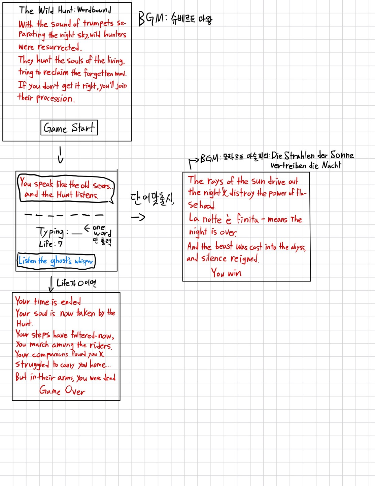
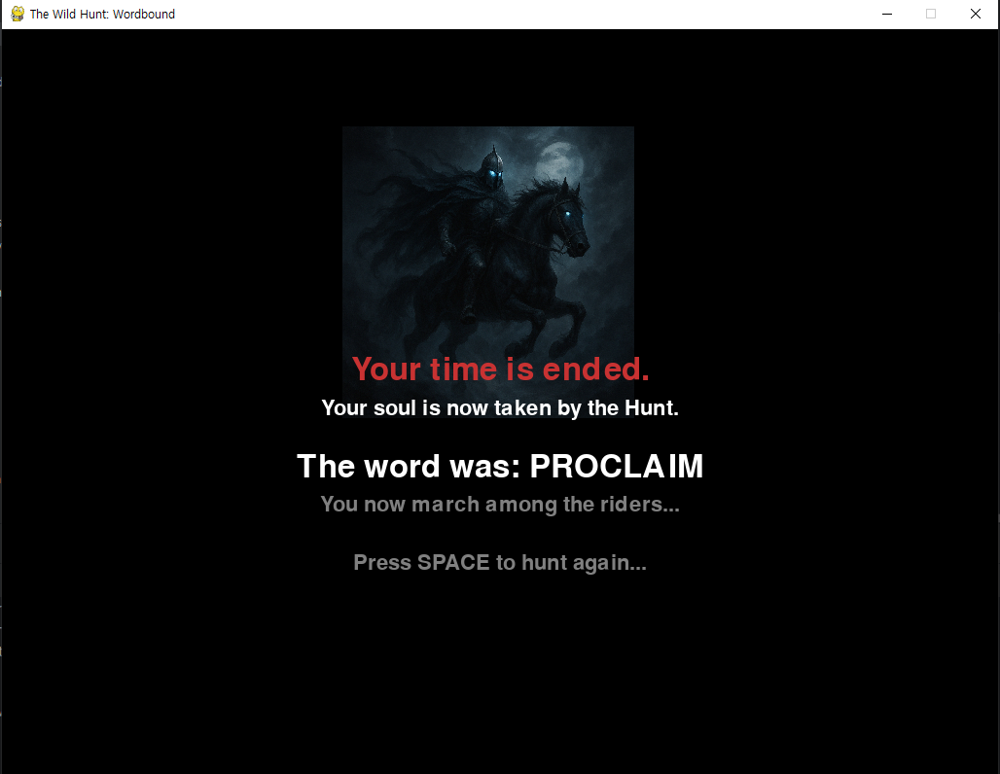

# The Wild Hunt: Wordbound

A dark fantasy-themed word guessing game inspired by European folklore, where players must solve words to escape the supernatural Wild Hunt.

## Overview

In this atmospheric hangman-style game, players face the legendary Wild Hunt - ghostly riders who collect souls in the night. Your only escape is to correctly guess the hidden word before your lives run out. Fail, and you'll join their eternal procession.

## Features

- **Atmospheric Storytelling**: Immersive dark fantasy theme with haunting narrative
- **Dynamic Difficulty**: Words ranging from 6-8 letters, with 7-letter words being most common
- **Visual Feedback**: Screen shake effects and transparency changes based on wrong guesses
- **Hint System**: Use the hint feature once per game to reveal a random letter
- **Real-time Word Fetching**: Words are fetched from Datamuse API for variety

## Game Screenshots

### Game Flow Blueprint

*Game design and flow documentation*

### Game Over Screen

*The haunting end screen when the Wild Hunt claims your soul*

## Installation & Requirements

### Dependencies
```bash
pip install pygame requests
```

### Required Assets
- `Wildhunter.png` - Wild Hunt rider image
- `elkking.mp3` - Background music (optional, see known issues)

## How to Play

1. **Start**: Press SPACE on the welcome screen
2. **Guess Letters**: Type a letter and press ENTER
3. **Use Hint**: Press H to reveal a random letter (once per game)
4. **Win Condition**: Guess all letters before running out of lives
5. **Lose Condition**: Make 7 wrong guesses and join the Wild Hunt

## Code Structure

### Main Class: `WildHuntHangman`

#### Core Functions

**`__init__()`**
- Initializes Pygame, loads assets, sets up fonts and game state
- Configures screen dimensions (1024x768) and color constants
- Sets up game variables and timers

**`fetch_random_word()`**
- Fetches random words from Datamuse API
- Filters for alphabetic words of target length (6-8 letters)
- Prioritizes 7-letter words for optimal difficulty

**`start_new_game()`**
- Resets all game variables for a fresh game
- Fetches new random word
- Initializes player state and UI elements

**`guess_letter(letter)`**
- Processes player's letter guesses
- Updates game state based on correct/incorrect guesses
- Triggers visual feedback and screen effects
- Checks for win/lose conditions

**`use_hint()`**
- Reveals a random unguessed letter from the target word
- Can only be used once per game
- Updates display and checks for win condition

**`show_fb(text, color)`**
- Displays temporary feedback messages to player
- Color-coded for different message types (success, error, info)

**`start_shake(intensity)`**
- Triggers screen shake effect for dramatic feedback
- Used when player makes incorrect guesses
- Intensity and duration are configurable

#### Visual Functions

**`get_shake_offset()`**
- Calculates random screen offset during shake effect
- Returns x,y coordinates for displaced rendering

**`draw_wild_hunt_silhouette(x, y)`**
- Renders the Wild Hunt rider image with dynamic transparency
- Alpha value increases with wrong guesses, making the threat more visible

**`draw_welcome_screen()`**
- Renders atmospheric intro with game lore and instructions

**`draw_game_screen()`**
- Main gameplay UI with word display, guess tracking, and status
- Includes shake effects and dynamic feedback

**`draw_end_screen()`**
- Victory or defeat screen with appropriate messaging and imagery

**`update()`**
- Handles per-frame updates for timers and effects
- Manages feedback display duration and shake animation

**`run()`**
- Main game loop handling events, updates, and rendering
- Manages game state transitions and user input

## Game States

- **welcome**: Intro screen with story and start prompt
- **playing**: Active gameplay with word guessing
- **win**: Victory screen when word is successfully guessed
- **game_over**: Defeat screen when lives are exhausted

## Visual Effects

- **Screen Shake**: Triggered on wrong guesses for dramatic impact
- **Dynamic Transparency**: Wild Hunt image becomes more visible with each mistake
- **Color-Coded Feedback**: Green for success, red for errors, blue for information
- **Atmospheric UI**: Dark theme with mystical color palette

## Known Issues

### BGM Debugging
The background music system (`elkking.mp3`) has known implementation issues that were not resolved due to time constraints. The music loading and playback functionality is present in the code but may not work correctly. This issue was deprioritized to focus on core gameplay mechanics.

**Affected Code:**
```python
pygame.mixer.music.load(self.background_music)
```

**Workaround:** The game is fully playable without background music. Audio can be ignored for gameplay purposes.

## Technical Specifications

- **Screen Resolution**: 1024x768
- **Framework**: Pygame
- **API Integration**: Datamuse API for word generation
- **Word Length**: 6-8 letters (weighted toward 7-letter words)
- **Lives**: 7 attempts before game over
- **Hint Usage**: Once per game

## File Structure
```
WB/
├── wildhunter_hangman.py    # Main game file
├── Wildhunter.png          # Wild Hunt rider sprite
├── elkking.mp3             # Background music (optional)
├── Blueprint.jpg           # Game design documentation
└── Game_Over.PNG           # End screen screenshot
```

## Running the Game
```bash
python wildhunter_hangman.py
```

## Credits
- Game Design: Original concept based on Wild Hunt folklore
- Visual Assets: Custom Wild Hunt imagery
- Word Generation: Powered by Datamuse API
